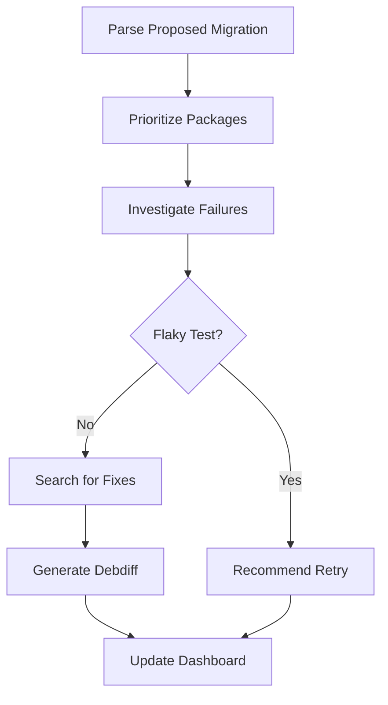

# Ubuntu Proposed Migration Helper Agent 🤖

> **GitHub Copilot Custom Agent** for automated analysis and fix generation for Ubuntu packages stuck in proposed migration.

[](https://github.com/utkarsh2102/ubuntu-proposed-migration-helper/actions)
[](https://opensource.org/licenses/MIT)

---

## 🎯 What is this?

This is a **GitHub Copilot Custom Agent** that automatically:

- 📊 **Parses** Ubuntu's [proposed migration data](https://people.canonical.com/~ubuntu-archive/proposed-migration/update_excuses.html) every 6 hours
- 🎯 **Prioritizes** packages based on component (main/universe), impact (how many packages blocked), team ownership, and age
- 🔍 **Investigates** FTBFS (build failures) and autopkgtest regressions
- 🔄 **Detects flaky tests** to save unnecessary debugging time
- 🔎 **Finds fixes** from Debian, upstream repositories, and other distributions
- 📝 **Generates debdiffs** ready for testing and upload
- 📋 **Creates a dashboard** with actionable insights

**Built for the GitHub Copilot Competition 2026** - Category 1: Creating Custom Agents Workflow

---

## 🚀 Features

### ✅ Automated Analysis

- Runs every 6 hours automatically via GitHub Actions
- No authentication required (all data sources are public)
- Tracks changes over time to identify trends

### 🎯 Smart Prioritization

Multi-dimensional scoring:
- **Component weight**: main (100) > restricted (75) > universe (50) > multiverse (25)
- **Blocker impact**: Packages blocking 10+ others get highest priority
- **Age factor**: Packages stuck >7 days are flagged as urgent
- **Team priority**: Security and foundations packages prioritized
- **Regression type**: New regressions vs known flaky tests

### 🔄 Flaky Test Detection

Saves hours of debugging by identifying:
- Timeout patterns
- Intermittent failures across architectures
- Network-related issues
- Race conditions

### 🔎 Multi-Source Fix Discovery

Searches for fixes in parallel across:
1. **Debian** (salsa.debian.org) - ~60% hit rate
2. **Upstream** repositories (GitHub, GitLab)
3. **Bug trackers** (Debian BTS, Launchpad)
4. **Other distributions** (Fedora, Arch)
5. **Ubuntu's history** (git-ubuntu, previous SRUs)

### 📝 Ready-to-Use Debdiffs

Generates properly formatted debdiffs with:
- DEP-3 patch headers
- Ubuntu changelog entries
- Source references (Debian commits, upstream fixes, etc.)
- Testing instructions
- Confidence scoring

---

## 📊 Dashboard

**Live Dashboard**: [View Dashboard](https://github.com/utkarsh2102/ubuntu-proposed-migration-helper/blob/main/output/dashboard.md)

The dashboard shows:
- Critical priority packages (score > 150)
- High/Medium/Low priority breakdown
- Flaky test recommendations with retry commands
- Packages grouped by team (foundations, server, desktop, etc.)
- Statistics and trends

---

## 🛠️ How It Works



### Workflow

1. **Every 6 hours**: GitHub Actions triggers the analysis
2. **Parse**: Fetch and parse proposed-migration data
3. **Score**: Calculate priority scores for all packages
4. **Investigate**: Analyze top 50 packages in detail
5. **Classify**: Separate flaky tests from real failures
6. **Search**: Find fixes from multiple sources
7. **Generate**: Create debdiffs for high-confidence fixes
8. **Publish**: Update dashboard and release debdiffs

---

## 📥 Using the Debdiffs

### Download

Debdiffs are available as [GitHub Releases](https://github.com/utkarsh2102/ubuntu-proposed-migration-helper/releases)

### Apply and Test

```bash
# Download the debdiff
wget https://github.com/utkarsh2102/ubuntu-proposed-migration-helper/releases/download/debdiffs-YYYYMMDD-HHMM/PACKAGE_VERSION.debdiff

# Get the source package
pull-lp-source PACKAGE noble

# Apply the debdiff
cd PACKAGE-VERSION
patch -p1 < ../PACKAGE_VERSION.debdiff

# Build and test
sbuild -d noble
autopkgtest PACKAGE_VERSION.dsc -- lxd ubuntu-daily:noble/amd64

# Upload (if tests pass)
debuild -S -sa
dput ubuntu PACKAGE_VERSION_source.changes
```

---

## 🎮 Manual Usage

### Analyze a Specific Package

Go to [Actions → Analyze Specific Package](https://github.com/utkarsh2102/ubuntu-proposed-migration-helper/actions/workflows/manual-package.yml) and click "Run workflow"

Enter the package name and optionally enable deep analysis.

### Trigger Full Analysis

Go to [Actions → Ubuntu Proposed Migration Analysis](https://github.com/utkarsh2102/ubuntu-proposed-migration-helper/actions/workflows/analyze.yml) and click "Run workflow"

---

## 📈 Impact & Metrics

*(These will be updated as the agent runs)*

| Metric | Count |
|--------|-------|
| Packages analyzed | TBD |
| Fixes generated | TBD |
| Debdiffs created | TBD |
| Flaky tests detected | TBD |
| Success rate | TBD |
| Estimated developer hours saved | TBD |

---

## 🏗️ Architecture

### Components

- **GitHub Actions**: Orchestration and scheduling
- **GitHub Copilot Custom Agent**: Intelligence layer
- **Skills**: Modular analysis components
  - Parser
  - Prioritizer
  - Investigator
  - Flaky detector
  - Fix finder
  - Debdiff generator
  - Dashboard builder

### Data Flow
- **Input**: Public Ubuntu/Debian infrastructure (no auth required)
- **Processing**: GitHub Actions runners
- **Storage**: Git repository (history, dashboard)
- **Output**: Debdiffs (GitHub Releases), Dashboard (GitHub Pages)

See [blueprint/blueprint.md](blueprint/blueprint.md) for complete architecture details.

---

## 📝 Development

### Project Structure
```
ubuntup-proposed-migration-helper/
├── .github/workflows/     # GitHub Actions workflows
├── agent/                 # Copilot agent configuration
│   ├── config/           # Agent config
│   ├── skills/           # Analysis skills
│   └── prompts/          # Agent prompts
├── scripts/              # Python scripts
├── data/                 # Historical data & patterns
├── output/               # Generated outputs
│   ├── dashboard.md      # Main dashboard
│   ├── debdiffs/         # Generated debdiffs
│   └── reports/          # Analysis reports
├── tests/                # Unit tests
└── docs/                 # Documentation
```

### Setup for Development
```bash
# Clone the repository
git clone https://github.com/utkarsh2102/ubuntu-proposed-migration-helper
cd ubuntu-proposed-migration-helper

# Install dependencies
pip install -r requirements.txt

# Run tests
pytest

# Run local analysis
python scripts/run_agent.py --action full_analysis
```

---

## 🗓️ Roadmap

See [todo/CHECKLIST.md](todo/CHECKLIST.md) for detailed implementation progress.

- [x] Repository setup
- [ ] Parser implementation
- [ ] Prioritization algorithm
- [ ] Flaky test detection
- [ ] Fix discovery (Debian)
- [ ] Fix discovery (upstream)
- [ ] Debdiff generation
- [ ] Dashboard generation
- [ ] GitHub Actions integration
- [ ] Testing & refinement
- [ ] Competition submission

---

## 📄 License

MIT License - see [LICENSE](LICENSE) for details

---

## 🙏 Acknowledgments

- Ubuntu Archive Team for maintaining proposed-migration infrastructure
- Debian for the excellent packaging ecosystem
- GitHub for the Copilot Competition
- All the Ubuntu developers who will (hopefully!) use this tool
